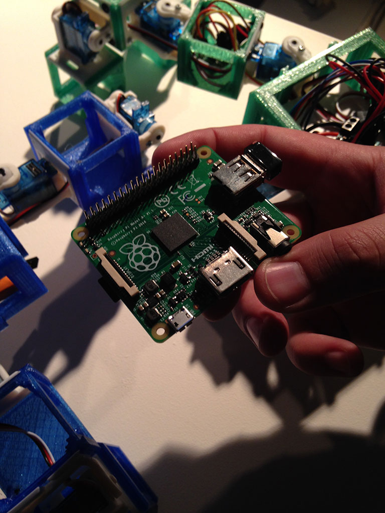

# ROBOTKLEUTERSCHOOL 

## Evoluerende robots

<video width="320" height="240" controls="controls" autoplay="autoplay" loop="loop">
<source src="videos/IMG_0599.mp4" type="video/mp4" />
</video>

<blockquote>
“Maken ze nu echt een robotkindje?”
</blockquote>

<blockquote>het DNA van de papa. Als ze een kind maken dan sturen ze dit brein naar een computer waar het crossover en muteert en dat printen wij dan weer op een plaat tot een kindje." Dus.</blockquote>

Stel dat robots kinderen konden krijgen. En hun kinderen ook weer. En die kinderen ook… Dan zouden we robotgeneraties en robotevolutie krijgen. Sciencefiction? Ja, maar steeds meer science en minder fiction.

Onderzoekers van de VU laten zien hoe hun robots zonder menselijk ingrijpen baby’s kunnen krijgen. Volg de evolutie van vele generaties robots in een computersimulatie. Duizenden jaren worden in een uur afgespeeld. Worden ze klein of worden ze groot? Krijgen ze poten of krijgen ze wielen?

Ook brengen de onderzoekers hun kleuterschool met klunzige robotjes naar Discovery Festival. Ze willen erachter komen hoe het leerproces in een groep robots werkt. De robots krijgen een taak – bijvoorbeeld het ontwijken van obstakels – maar er wordt hen niet verteld hoe ze deze moeten volbrengen. Autonoom voeren ze hun taak uit. Als er eentje achter komt, vertelt hij het dan aan de anderen? Kom naar de Robotkleuterschool en kijk zelf naar de robotjes in opleiding. Lukt het ze om niet te botsen, 
of wordt het huilen?
