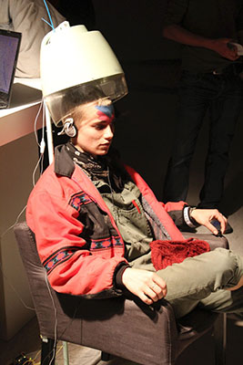

# Sweet spots

<blockquote>“Mmmm dit is wel lekker!”</blockquote>

Bij Sweet Spots laten mensen hun hoofd masseren terwijl ze muziek luisteren. Maar niet zomaar: door het tempo van het masseren aan te passen met knopjes aan de stoel wordt de muziek ook anders. De uitdaging is om een perfecte balans tussen beide te vinden: een ritmische massage.
