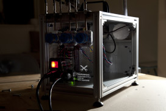

# Discovery Festival

Enter intro text here.

# Colophon

## Discovery Festival

<<<<<<< HEAD
**Editors:** <!-- to be added --> Discovery Festival  
**Copy-editing:** <!-- to be added --> Discovery Festival 
=======
**Authors:** Monique Koopmans and Maureen Voestermans
**Editors:** Discovery Festival 
**Copy-editing:** PublishingLab  
>>>>>>> origin/master
**Design:** OK200 
**EPUB development:** PublishingLab team existing out of; Josip Batinic, Joana Chicau, Inte Gloerich, Gottfried Haider, Anatasia Kubrak, Margreet Riphagen, Léna Robin, Karina Zavidova, Jess van Zyl 
**Publisher:** PublishingLab in collaboration with Discovery Festival, Amsterdam, 2015. PublishingLab is part of the Amsterdam Creative Industries Network. <http://www.amsterdamcreativeindustries.com>  
**Contact:** PublishingLab, <http://www.publishinglab.org> 

This publication is available through various print on demand services. For more information, and a freely downloadable PDF:
<http://**website**> 
This publication is licensed under the Creative Commons Attribution-NonCommercial-NoDerivatives 4.0 International (CC BY-NC-SA 4.0).  

# Contents

<a href="ch002.xhtml">Introduction</a> 

<a href="ch003.xhtml">Title</a> 
 
<a href="ch004.xhtml">Maureen over de DIY Surgical Robot</a>
#Article Title: Maureen over de DIY Surgical Robot

## Text/Paragraph header

### Author/event subheader: Maureen Voestermans

<!--body text has no tags-->
[Discovery Festival](http://www.discoveryfestival.nl/)
This is a real hashtag, not header \#grumpycat
In de hal van het **ziekenhuis** maakt de man herhaaldelijk vreemde huppelsprongetjes. Ook heeft hij daarbij de nijging om steeds naar de grond te duiken alsof hij iets opraapt en om met twee vingers tegelijkertijd de muur aan te raken. Als de man de operatiekamer inloopt gaat hij ook ineens vreemde pikkende bewegingen maken met zijn handen, inmiddels in latex handschoenen gestoken: de operatie gaat beginnen. De man is chirurg Bennett, uitvoerig beschreven door wijlen Oliver Sacks in zijn prachtige boek Een antropoloog op Mars. Bennett lijdt aan het syndroom van Gilles de la Tourette, waarbij mensen extreem dwangmatig gedrag vertonen (en vaak ook dwangmatige gedachten hebben). Als Bennett echter zijn scalpel ter hand neemt verdwijnen zijn tics volledig: met extreme precisie snijdt hij weefsel, en hecht het even nauwkeurig weer aan elkaar.

Om chirurg te worden moet je bezitten over een hoog ontwikkelde fijne motoriek en een haarscherpe concentratie. Hoewel de man beschreven door Oliver Sacks een absolute topchirurg is kan hij, los van zijn syndroom, altijd een foutje maken. Fouten zijn nou eenmaal menselijk. Zou een robot op den duur veiliger en beter zijn?

#### Druifjes hechten
Technisch gezien zijn robots goed in staat tot heel secuur werk. Kijk maar eens naar deze video waarin een robot een ontvelt druifje weer vastnaait:
# Maureen over de DIY Surgical Robot

Door Maureen Voestermans

In de hal van het ziekenhuis maakt de man herhaaldelijk vreemde huppelsprongetjes. Ook heeft hij daarbij de nijging om steeds naar de grond te duiken alsof hij iets opraapt en om met twee vingers tegelijkertijd de muur aan te raken. Als de man de operatiekamer inloopt gaat hij ook ineens vreemde pikkende bewegingen maken met zijn handen, inmiddels in latex handschoenen gestoken: de operatie gaat beginnen. De man is chirurg Bennett, uitvoerig beschreven door wijlen Oliver Sacks in zijn prachtige boek Een antropoloog op Mars. Bennett lijdt aan het syndroom van Gilles de la Tourette, waarbij mensen extreem dwangmatig gedrag vertonen (en vaak ook dwangmatige gedachten hebben). Als Bennett echter zijn scalpel ter hand neemt verdwijnen zijn tics volledig: met extreme precisie snijdt hij weefsel, en hecht het even nauwkeurig weer aan elkaar.

Om chirurg te worden moet je bezitten over een hoog ontwikkelde fijne motoriek en een haarscherpe concentratie. Hoewel de man beschreven door Oliver Sacks een absolute topchirurg is kan hij, los van zijn syndroom, altijd een foutje maken. Fouten zijn nou eenmaal menselijk. Zou een robot op den duur veiliger en beter zijn?

###Druifjes hechten
Technisch gezien zijn robots goed in staat tot heel secuur werk. Kijk maar eens naar deze video waarin een robot een ontvelt druifje weer vastnaait:

Maar of ze in klinische setting echt beter werk verrichten? Chirurg Jeroen Heemskerk onderzocht het en kwam met tegenvallende resultaten: “ze presteren niet beter dan chirurgen, maar zijn wel peperduur”. Inderdaad kosten de dingen ruim anderhalf miljoen, plus onderhoudskosten van een ton per jaar. Toch schaffen veel ziekenhuizen ze aan om meer patiënten te trekken die vaak de (valse) hoop hebben dat een robot beter werk verricht. Niet echt netjes… Maar wie weet: wellicht dat praktijkervaring ze op den duur toch beter maakt? Een groot voordeel zou wel zijn dat ze theoretisch op afstand bestuurd kunnen worden; specialisten zouden zo letterlijk wereldwijd kunnen opereren.

###Do it yourself
Op Discovery staat kunstenaar Frank Kolkman met zijn DIY Surgical Robot. DIY staat voor Do It Yourself: een trend waarbij mensen zelf dingen gaan doen die normaal gesproken onder het takenpakket van een expert vallen. Zo zijn er video’s op youtube waarin uitgelegd staat hoe je zelf een huis kan bouwen, maar ook hoe je zelf een vulling in je kies kan zetten:

<iframe width="560" height="315" src="https://www.youtube.com/embed/2GC8RxLnbio" frameborder="0" allowfullscreen="1"></iframe>

Frank Kolkman wilde weten of het mogelijk zou zijn om voor de do-it-yourself-ers ook een operatie robot te maken. Hij moest daarvoor ontzettend veel technische kennis opdoen en worstelde ook met patentkwesties en open-source idealen (iedereen zou idealiter de software van de robot moeten kunnen inzien en verbeteren). Bezoek hem om te weten wat je allemaal via eBay zou moeten bestellen om in geval van nood je eigen zorgrobot in elkaar te knutselen, maar vooral: zie die van hemzelf in actie!

