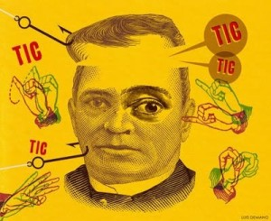
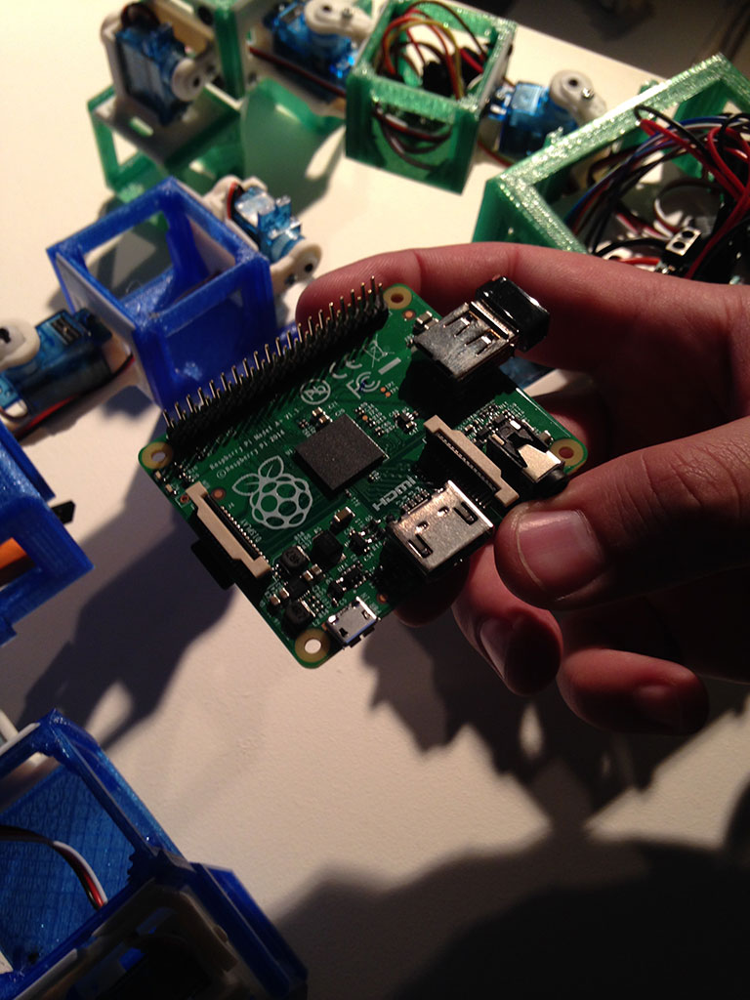
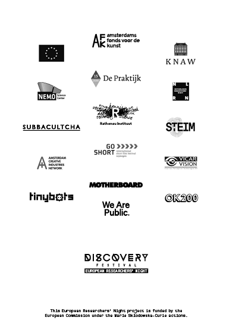
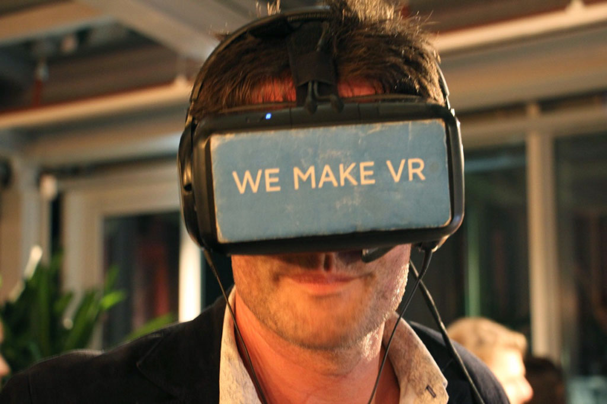
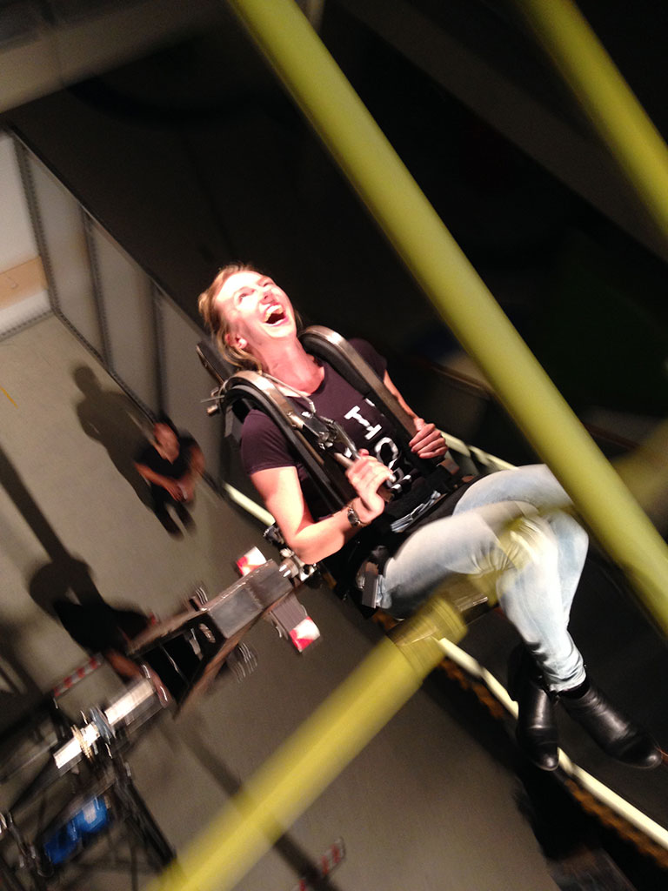
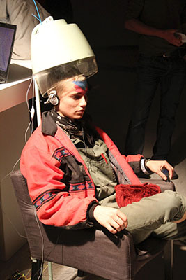

# Discovery Festival

Discovery Festival is the most progressive and most mature science / art / music festival in the Netherlands. These are the festival highlights of 2015.

# Colophon

## Discovery Festival

**Head Editors:** <!-- to be added --> Discovery Festival 
**Copy-editing:** <!-- to be added --> Discovery Festival 
**Authors:** Monique Koopmans and Maureen Voestermans 
**Editors:** Discovery Festival 
**Copy-editing:** PublishingLab  
**Design:** OK200 
**EPUB development:** PublishingLab team, consisting of: Josip Batinic, Joana Chicau, Inte Gloerich, Gottfried Haider, Anatasia Kubrak, Margreet Riphagen, Léna Robin, Karina Zavidova, Jess van Zyl 
**Publisher:** PublishingLab in collaboration with Discovery Festival, Amsterdam, 2015. PublishingLab is part of the [Amsterdam Creative Industries Network](http://www.amsterdamcreativeindustries.com)  
**Contact:** [PublishingLab](http://www.publishinglab.org) 

# Contents

<a href="ch002.xhtml">Discovery Festival</a> 

<a href="ch003.xhtml">Colophon</a> 

<a href="ch004.xhtml">Contents</a> 
 
<a href="ch005.xhtml">Next chapter</a>

# Article Title: 

## Text/Paragraph header

### Author/event subheader: 

<!--body text has no tags-->
[Discovery Festival](http://www.discoveryfestival.nl/)
Lorem ipsum, This is a real hashtag, not header \#grumpycat and this is **bold**. 

# Article Title: ROBOTKLEUTERSCHOOL 

## Text/Paragraph header

### Author/event subheader: 

<!-- insert video -->

<blockquote>
“Maken ze nu echt een robotkindje?”
</blockquote>

<blockquote>het DNA van de papa. Als ze een kind maken dan sturen ze dit brein naar een computer waar het crossover en muteert en dat printen wij dan weer op een plaat tot een kindje." Dus.</blockquote>

Stel dat robots kinderen konden krijgen. En hun kinderen ook weer. En die kinderen ook… Dan zouden we robotgeneraties en robotevolutie krijgen. Sciencefiction? Ja, maar steeds meer science en minder fiction.

Onderzoekers van de VU laten zien hoe hun robots zonder menselijk ingrijpen baby’s kunnen krijgen. Volg de evolutie van vele generaties robots in een computersimulatie. Duizenden jaren worden in een uur afgespeeld. Worden ze klein of worden ze groot? Krijgen ze poten of krijgen ze wielen?

Ook brengen de onderzoekers hun kleuterschool met klunzige robotjes naar Discovery Festival. Ze willen erachter komen hoe het leerproces in een groep robots werkt. De robots krijgen een taak – bijvoorbeeld het ontwijken van obstakels – maar er wordt hen niet verteld hoe ze deze moeten volbrengen. Autonoom voeren ze hun taak uit. Als er eentje achter komt, vertelt hij het dan aan de anderen? Kom naar de Robotkleuterschool en kijk zelf naar de robotjes in opleiding. Lukt het ze om niet te botsen, 
of wordt het huilen?

# Discovery Festival Sponsors

This European Researchers' Night project is funded by the European Commission under the Marie Skłodowska-Curie actions.

Thanks to the sponsors of Discovery Festival:

# Article Title: A Perfect Party

## Text/Paragraph header

### Author/event subheader: 

<!--body text has no tags-->

<blockquote>
“Wauw dit ziet er wel echt vet uit”
</blockquote>

Wat als je in een film kan kiezen waar je kan gaan staan? Dat er meerdere verhaallijnen zijn en je zelf kan bepalen bij welke acteurs je in een scene gaat bekijken? Filmmaking 2.0. Bij A Perfect Party bepaal je zelf als kijker hoe de film verloopt.

# Neurotransmitter 3000

<blockquote>"beetje een astronauten-training dit"</blockquote>

Een machine met een doorsnede van 7 meter die ontzettend snel kan draaien en eigenlijk maar door één persoon kan worden aangestuurd. Daniël de Bruin is ontwerper en onderzoekt hoe je als maker onderdeel uitmaakt van het productieproces. Want als machines al je werk uitvoeren, wat is er dan nog authentiek? Vanuit deze gedachte ontwierp Daniël de Neurotransmitter 3000, een attractie waarin alleen Daniël plaatsneemt en die reageert op 
de angst van Daniël zelf. 

Een relatie dus, tussen mens en machine. Tijdens Discovery Festival zal Daniël zijn machine voor het eerst laten draaien op zijn eigen E.E.G-data.

<blockquote>“ik ga hier echt niet de hele avond inzitten hoor dan wordt ik echt helemaal gek”</blockquote>

# Sweet spots

Sweet Spots is een muzikaal experiment, waarin naast geluid ook aanraking een rol speelt. Onder begeleiding van een machinale massage probeer je controle te krijgen over verschillende ritmes. Neem plaats, draai aan de knoppen, en vind de sweet spot waar de ritmische aanrakingen en geluiden samenkomen en één worden.

<blockquote>“Mmmm dit is wel lekker!”</blockquote>

Roland van Dierendonck en Matei Szabo maakten Sweet Spots in de opleiding Media Technology van de Universiteit Leiden, waarin studenten van verschillende achtergronden worden uitgedaagd om autonome wetenschappers te worden, bijvoorbeeld door te knutselen met nieuwe technologieën.

<blockquote>“Het lijkt wel alsof hij naar de kapper gaat.”</blockquote>

