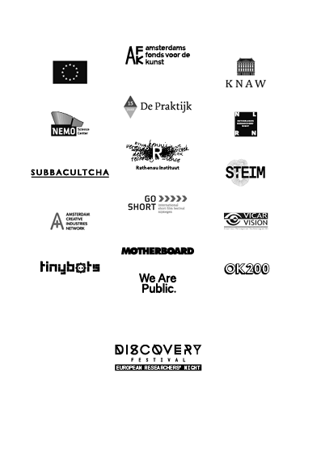

# Discovery Festival

Discovery Festival is the most progressive and most mature science / art / music festival in the Netherlands. These are the festival highlights of 2015.

# Colophon

## Discovery Festival

**Head Editors:** <!-- to be added --> Discovery Festival 
**Copy-editing:** <!-- to be added --> Discovery Festival 
**Authors:** Monique Koopmans and Maureen Voestermans 
**Editors:** Discovery Festival 
**Copy-editing:** PublishingLab  
**Design:** OK200 
**EPUB development:** PublishingLab team, consisting of: Josip Batinic, Joana Chicau, Inte Gloerich, Gottfried Haider, Anatasia Kubrak, Margreet Riphagen, Léna Robin, Karina Zavidova, Jess van Zyl 
**Publisher:** PublishingLab in collaboration with Discovery Festival, Amsterdam, 2015. PublishingLab is part of the [Amsterdam Creative Industries Network](http://www.amsterdamcreativeindustries.com)  
**Contact:** [PublishingLab](http://www.publishinglab.org) 

# Contents

<a href="ch002.xhtml">Discovery Festival</a> 

<a href="ch003.xhtml">Colophon</a> 

<a href="ch004.xhtml">Contents</a> 
 
<a href="ch005.xhtml">Next chapter</a>

# Article Title: 

## Text/Paragraph header

### Author/event subheader: 

<!--body text has no tags-->
[Discovery Festival](http://www.discoveryfestival.nl/)
Lorem ipsum, This is a real hashtag, not header \#grumpycat and this is **bold**. 

# Article Title: 

## Text/Paragraph header

### Author/event subheader: 

<!--body text has no tags-->
[Discovery Festival](http://www.discoveryfestival.nl/)
Lorem ipsum, This is a real hashtag, not header \#grumpycat and this is **bold**. 

# Article Title: ROBOTKLEUTERSCHOOL 

## Text/Paragraph header

### Author/event subheader: 

<blockquote>
“Maken ze nu echt een robotkindje?”
</blockquote>

Hoe zorg je ervoor dat robots kinderen maken? Dat kan zo: je geeft twee robots willekeurige 

rekenregels mee. Sommigen zullen de skill hebben om te kunnen lopen. Deze lopers komen 

weer makkelijker een partner tegen waarmee ze rekenregels kunnen uitwisselen en 

nageslacht van zo`n loper heeft ook weer meer kans op loopgenen. Lopen = dus seks = 

nageslacht. Zo dus.
# Discovery Festival Sponsors

This European Researchers' Night project is funded by the European Commission under the Marie Skłodowska-Curie actions.

Thanks to the sponsors of Discovery Festival:

# Testing video embedd

<video width="320" height="240" controls="controls">
<source src="videos/IMG_0599.mp4" type="video/mp4" />
</video>

# Neurotransmitter 3000

"beetje een astronauten-training dit"

# Sweet spots

<blockquote>“Mmmm dit is wel lekker!”</blockquote>

Bij Sweet Spots laten mensen hun hoofd masseren terwijl ze muziek luisteren. Maar niet zomaar: door het tempo van het masseren aan te passen met knopjes aan de stoel wordt de muziek ook anders. De uitdaging is om een perfecte balans tussen beide te vinden: een ritmische massage.

